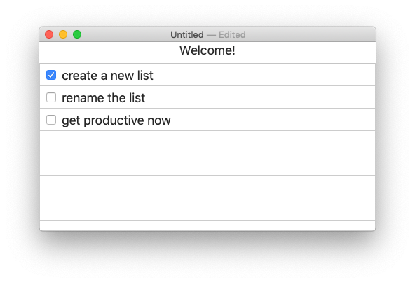

# To-Do-List Example Apps


[](https://travis-ci.org/ReSwift/ReSwift-Todo-Example) 

To-Do example app for macOS, utilizing [ReSwift](http://reswift.github.io/) as the primary means to control data flow.

- `NSDocument`-based
- Reactive, redux-like UI bindings using ReSwift
- Reusable state for cross-platform development



## Setup

```sh
$ carthage bootstrap
$ open ReSwift-Todo-Example.xcodeproj/
```

## License

Copyright &copy; 2016 ReSwift Community. Distributed under the MIT License (MIT).
